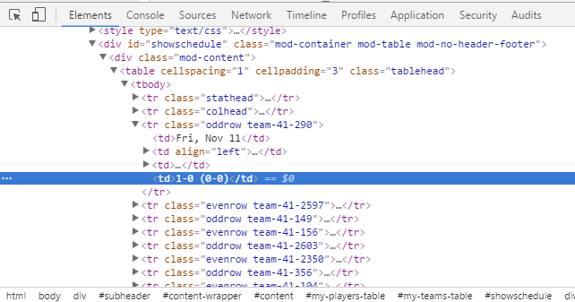

# Summary  

Data scraping is an imperative tool for the automation of gathering and cleaning massive amounts of data from online sources. This project examined collegiate basketball schedules from the 351 Division I Universities in the United States, which were scraped from ESPN’s website using the R programming package, rvest. Geospatial data queried from Google Map’s API was combined with the basketball data to create an interactive application that enables users of any statistical experience to visually explore the travel patterns of collegiate basketball teams. Because the associated data is generated using an automated data scraping process, future use of this application will incorporate new and updated information, an example of how researchers can save valuable time for data exploration and analysis. A guide for data scraping using R was created to assist undergraduate students for learning this tool.

# Introducing *rvest*

*Rvest* is an R package that extracts data on webpages. For this example, we will ‘scrape’ ESPN's website and retrieve North Carolina State University’s basketball schedule.

Here are the generalized steps for extracting data:

1. **Read** in the raw webpage code using *read_html()*
2. **Identify** the desired data, which are located in containers called *nodes*
3. **Extract** that data from the identified nodes

Install the `rvest` package and SelectorGadget ([Chrome Web Store](https://chrome.google.com/webstore/detail/selectorgadget/mhjhnkcfbdhnjickkkdbjoemdmbfginb?hl=en)) to follow along with this example.

**Note:** Check for [rvest updates](https://github.com/hadley/rvest) on github. 

***


#### **Step 1: Identify Source**  

First, we need to **identify a URL path** and let *rvest* save the webpage's source code. Let's save the XML source code for NC State University's [basketball schedule](http://www.espn.com/mens-college-basketball/team/schedule/_/id/152/nc-state-wolfpack) on ESPN's website.

````{r, eval=FALSE}
#Load the rvest package, installs if it hasn't already been installed
install.packages("rvest")
````

```{r, echo=FALSE}
library(rvest)
```


```{r}
#Store the url of the schedule's webpage
url <- "http://www.espn.com/mens-college-basketball/team/schedule/_/id/152/nc-state-wolfpack"

#Save the source code in variable 'page'
page <- read_html(url)

print(page)
````


The webpage is written in XML, evidenced by the first line of output. Fortunately, the __*read_html()* function reads HTML and XML interchangeably__.


#### **Step 2: Identify Desired Nodes**   

Next, we must **identify where the data is** on the webpage. We do this using **CSS selectors**. CSS selectors describe how the elements, or **nodes**, on a webpage are structured. For more detailed information, read the info on [W3schools.com](http://www.w3schools.com/cssref/css_selectors.asp). 

CSS selectors narrow down where the desired data is on the webpage. Open the [NCSU basketball schedule](http://www.espn.com/mens-college-basketball/team/schedule/_/id/152/nc-state-wolfpack) and try to use the SelectorGadget extension to select the table.

Unfortunately, SelectorGadget struggles to find a "valid path" for the table. All this means is that SelectorGadget could not identify a CSS selector, but do not worry. Sometimes, SelectorGadget has trouble with certain webpages - luckily, we can work around that problem.


Right-click any cell in the table and select _**Inspect**_. The page’s XML code appears in a window.



The selected line of code corresponds to the cell that you right-clicked.

We must find the line of code that defines the node for the desired table. HTML and XML nest nodes within each other. A **_parent node_** is the node in which a certian node is nested within. The node inside the parent node is called a **_child node_**. Much like humans, nodes can both be a parent node and a child node. They may have multiple children nodes as well. Looking back at the inspection window, we can see how each child node is nested inside its parent node. My selection in _Figure 1_ has the parent node: 

> <**td**>...\<td>

And that node’s parent node is:

> <**tr** class="oddrow team-41-290">

The leading word of each node, in bold above, is that node's CSS selector.

Notice that when you select a node in the code source inspection window, **that node is also selected _in your browser_**. Start at the table cell you selected and select its parent node. Select that node's parent node and keep selecting parent nodes in this manner until you select a line of code that looks like this:


> <**table** cellspacing=”1” cellpadding=”3” class =”tablehead”>


The most important thing to notice is the leading term **table**. That is the CSS selector! Right click the line of code in the inspection window and select **_Copy > Copy selector_**. The CSS selector is copied to your clipboard as *#showschedule > div > table*. Return to your R script:

````{r}
  #Extract the specified nodes from the web page 
	nodes <- html_nodes(page, "#showschedule > div > table")
	                    
	print(nodes)
````

*html_nodes()* returns an object with every node on the webpage which your specified selector matches. If there were multiple tables, *html_nodes* would return each of them in a list.


#### **Step 3: Extract Data**  

The *nodes* variable now contains the table node with the data we are interested in. To extract the desired data, we have to use the appropriate *rvest* function. In this case, we are extracting a structured table, so we should use *html_table()*, which returns a list of data frames. Other extraction functions include:

* html_text()
* html_name()
* html_form()

````{r} 
	ncsuTable <- html_table(nodes, header = TRUE)
	head(ncsuTable[[1]], n = 4)
````

There you go, we officially have our data! Albeit, it is fairly messy -- now you must clean it! 

***

# Cleaning the data

Cleaning the extracted data is one of the most time consuming parts of data scraping. The following tools are incredibly helpful and are highly recommended:

* __dplyr__ -- A package for manipulating data frames in a SQL-like manner.
* __stringr__ -- A package for manipulating character data. 
* __lubridate__ -- A package for time/date data.
* __Regex__ -- Regular Expressions (*Regex*) is a pattern recognition, psuedo-language for character data. It is invaluable when working with semi-structured character data. Try out the interactive [RegexOne tutorial](https://regexone.com/lesson/introduction_abcs) to learn and practice regex structure.


````{r}
	#Put the extracted table in the schedule variable
	schedule <- ncsuTable[[1]]
	
	#use the first row as the column names
	names(schedule) <- schedule[1,]
	
	names(schedule)
	
	#get rid of the first row, which had the column names.
	schedule <- schedule[-c(1),]
````

#### First column - Parse Dates

````{r}
	#load the lubridate library
	library("lubridate")
	
	# Convert first column into date type
	# %a = abbreviated weekday
	# %b = abbreviated month
	# %d = day of month
	schedule$DATE <- as.Date(schedule$DATE, format = "%a, %b %d")
````

`DATE` is now homogenous! (*Lubridate*)[https://cran.r-project.org/web/packages/lubridate/lubridate.pdf] is an excellent date/time package, making it easy to do mathmatical operations or extracting secondary information, such as whether the date fell on a Monday.


# References

NCSU Basketball Schedule [http://www.espn.com/mens-college-basketball/team/schedule/_/id/152/nc-state-wolfpack](http://www.espn.com/mens-college-basketball/team/schedule/_/id/152/nc-state-wolfpack)

CSS Selectors explained by W3schools. [http://www.w3schools.com/cssref/css_selectors.asp](http://www.w3schools.com/cssref/css_selectors.asp)

SelectorGadget. [https://chrome.google.com/webstore/detail/selectorgadget/mhjhnkcfbdhnjickkkdbjoemdmbfginb?hl=en](https://chrome.google.com/webstore/detail/selectorgadget/mhjhnkcfbdhnjickkkdbjoemdmbfginb?hl=en)

RegexOne. [https://regexone.com/lesson/introduction_abcs](https://regexone.com/lesson/introduction_abcs)


# TODO

Notes for future additions

* Working Selector example, prior to one that doesn't work
* Why scrape?
* Advantages
* disadvantages

